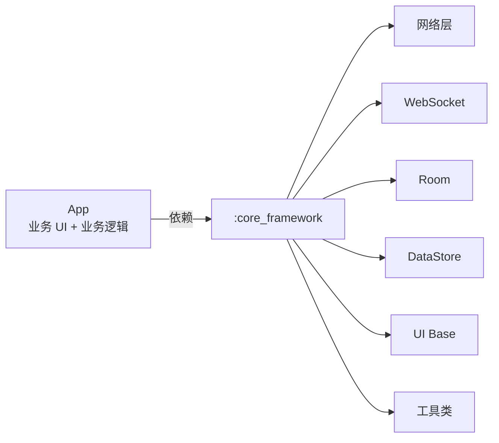

# Android 框架模板

> 基于 Kotlin 的 Android MVVM 项目模板，所有通用能力已抽离到 `:core_framework` Library module。
> 新建项目时只需专注业务 UI 与接口，开箱即用。

[](https://kotlinlang.org)
[](https://developer.android.com/studio/releases/gradle-plugin)
[](https://developer.android.com/about/versions)
[](./LICENSE)

## ✨ 核心特性

| 能力 | 实现亮点 |
| --- | --- |
| 🌐 **网络层** | Retrofit + OkHttp + 4 个职责清晰的自定义 Interceptor (Token / Auth / Version / Logging)，双模式 SSL (Debug 信任所有 / Release 读 raw 证书) |
| 🔌 **WebSocket** | 单例管理 + 自动重连 + Flow 状态/消息流 + 与网络层共享 SSL 配置 |
| 💾 **数据持久化** | Room (KSP 编译) + DataStore Preferences + SharedPreferences 双写双读防丢 |
| 🎨 **UI 基类** | ViewBinding 泛型 BaseActivity / BaseFragment / BaseDialog(DialogFragment) + 全屏 + 软键盘自适应 |
| 🧰 **工具类** | TimberUtil / DeviceUtils / ScreenUtil / LanguageUtils / FullScreenUtils / EditTextExtensions... |
| 🏛️ **架构** | MVVM + 单 Activity + 多 Fragment，框架层与应用层彻底解耦 |
| 🚀 **异步** | Kotlin Coroutines + Flow，统一暴露状态与事件 |

## 📦 项目结构

```
AndroidFrameworkTemplate/
├── app/                    # 业务壳，仅含示例 DemoActivity
│   └── src/main/java/com/example/template/
│       ├── App.kt          # Framework.init() 初始化
│       └── MainActivity.kt # 演示完整框架调用链路
│
├── core_framework/         # 框架库（Library module）
│   └── src/main/java/com/template/framework/
│       ├── Framework.kt                # 统一入口
│       ├── api/                        # 网络层
│       │   ├── NetworkModule.kt        # Retrofit/OkHttp/SSL 工厂
│       │   ├── ApiService.kt           # 示例接口
│       │   ├── TokenInterceptor.kt     # 自动注入 Authorization
│       │   ├── AuthErrorInterceptor.kt # 处理 HTTP 401 与业务 401
│       │   ├── VersionInterceptor.kt   # 自动注入 VersionCode/Name
│       │   └── HttpLoggingInterceptor.kt # 详细日志
│       ├── websocket/WebSocketManager.kt
│       ├── database/                   # Room 模板
│       ├── datastore/                  # DataStore + 备份双写
│       ├── repository/FrameworkRepository.kt
│       ├── ui/base/                    # Base + Adapter
│       ├── util/                       # 工具类集合
│       └── constants/FrameworkConstants.kt
│
├── docs/
│   ├── ARCHITECTURE.md     # 架构详细说明（含 Mermaid 图表）
│   └── QUICKSTART.md       # 接入新项目 5 步指南
│
├── gradle/libs.versions.toml   # 统一依赖版本管理
└── settings.gradle.kts
```

## 🚀 快速开始

### 1. 运行 Demo

```bash
git clone https://github.com/SiXuManYan/AndroidFrameworkTemplate.git
# 用 Android Studio 打开 → Sync Gradle → Run ':app'
```

启动后进入 `MainActivity`，可：
- 输入 IP/端口 → 点击「保存设置」测试 DataStore 持久化
- 点击「调用 Login API」测试网络层（Retrofit + 4 个 Interceptor + Token 注入）
- 点击「连接 WebSocket」测试 WebSocket 自动重连

### 2. 接入新项目

参考 [docs/QUICKSTART.md](./docs/QUICKSTART.md)，5 步完成接入：

1. 复制本工程
2. 全局替换包名（`com.example.template` → 你的应用包名）
3. 配置签名与版本号
4. 配置 `FrameworkConfig`（SSL 证书 / API 前缀等）
5. 实现业务接口与 UI

## 💡 使用示例

### 初始化框架

```kotlin
class App : Application() {
    override fun onCreate() {
        super.onCreate()
        Framework.init(
            app = this,
            config = FrameworkConfig(
                debug = BuildConfig.DEBUG,
                versionCode = BuildConfig.VERSION_CODE,
                versionName = BuildConfig.VERSION_NAME,
                sslCertRawResId = R.raw.my_cert  // Release 模式 SSL 证书
            )
        )
        // Token 失效时自动跳转登录页
        Framework.setOnTokenExpired { /* startActivity(...) */ }
    }
}
```

### 调用 API

```kotlin
class MyViewModel : ViewModel() {
    private val repo = Framework.getRepository()

    fun login() = viewModelScope.launch {
        val response = repo.login(
            DeviceLoginRequest(grantType = "device", snNumber = "SN001")
        )
        if (response.isSuccess) {
            Framework.getPreferences().saveAccessToken(response.data!!.accessToken)
        }
    }
}
```

### 继承 UI 基类

```kotlin
class ProfileActivity : BaseActivity<ActivityProfileBinding>() {
    override fun initViewBinding() = ActivityProfileBinding.inflate(layoutInflater)
    override fun initView() { /* 初始化视图 */ }
    override fun initListener() { /* 设置监听 */ }
    override fun initData() { /* 加载数据 */ }
}
```

### 监听 WebSocket

```kotlin
lifecycleScope.launch {
    Framework.getRepository().webSocketMessageFlow.collect { msg ->
        msg?.let { handleMessage(it) }
    }
}
```

## 🏗️ 架构概览



> 📐 完整分层与流程图见 [docs/ARCHITECTURE.md](./docs/ARCHITECTURE.md)

## 🛠️ 技术栈

| 类别 | 选型 |
| --- | --- |
| 语言 | Kotlin 2.0.21 |
| 构建 | AGP 8.13.1, Gradle 8.x, KSP |
| UI | ViewBinding + Material Components |
| 网络 | Retrofit 2.11 + OkHttp 4.12 |
| WebSocket | OkHttp WebSocket |
| 数据库 | Room 2.6 (KSP) |
| 偏好 | DataStore Preferences 1.1 |
| 异步 | Kotlin Coroutines 1.9 + Flow |
| 日志 | Timber 5.0 |

## 🎯 设计原则

- **框架与应用彻底解耦** - 框架层零业务依赖，`FrameworkConfig` 注入运行时配置
- **配置驱动而非代码耦合** - SSL 策略 / 日志策略 / Token 注入均通过配置 + 拦截器实现
- **防御性兜底** - DataStore + SharedPreferences 双写双读、防网络抖动重试、Token 自动刷新
- **可裁剪** - 每个组件均可独立替换，业务只需继承基类即可定制

## 📚 文档导航

| 文档 | 内容 |
| --- | --- |
| [docs/ARCHITECTURE.md](./docs/ARCHITECTURE.md) | 分层架构 + 各模块职责 + 核心流程图 |
| [docs/QUICKSTART.md](./docs/QUICKSTART.md) | 接入新项目 5 步指南 + 7 个常见问题 |

## 🗺️ 路线图

- [ ] 网络层支持请求重试 / 退避策略
- [ ] WebSocket 支持心跳保活配置
- [ ] BaseFragment 支持 ViewModel 注入封装
- [ ] 增加图片加载模块（Glide / Coil 可选）
- [ ] 增加视频播放模块（Media3 / ExoPlayer 可选）
- [ ] Compose 适配层

## 🤝 贡献

欢迎提 Issue / PR！建议流程：

1. Fork 本仓库
2. 创建特性分支（`git checkout -b feature/amazing-feature`）
3. 提交改动（`git commit -m 'feat: add amazing feature'`）
4. 推送分支（`git push origin feature/amazing-feature`）
5. 创建 Pull Request

## 📄 License

MIT © 2026 Shiwei Wang

---

⭐ 如果这个项目对你有帮助，欢迎 Star 支持！