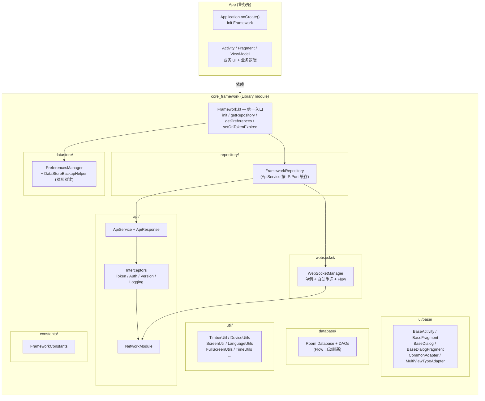
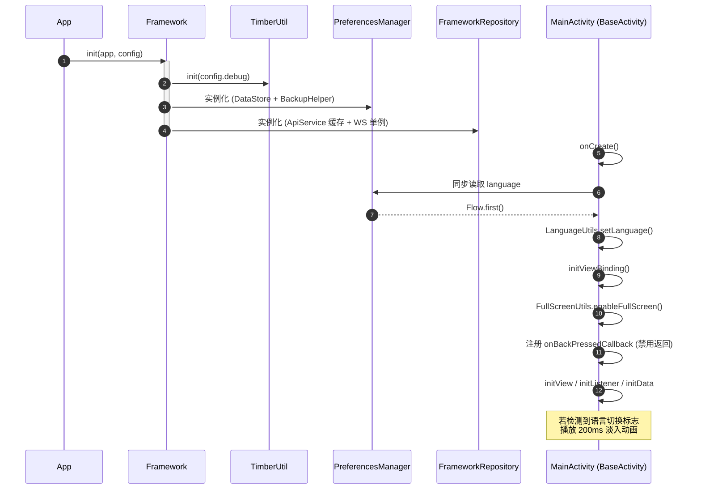
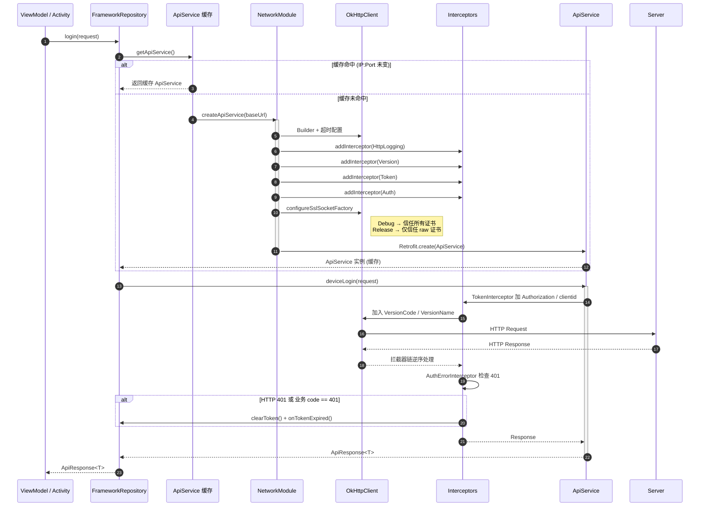
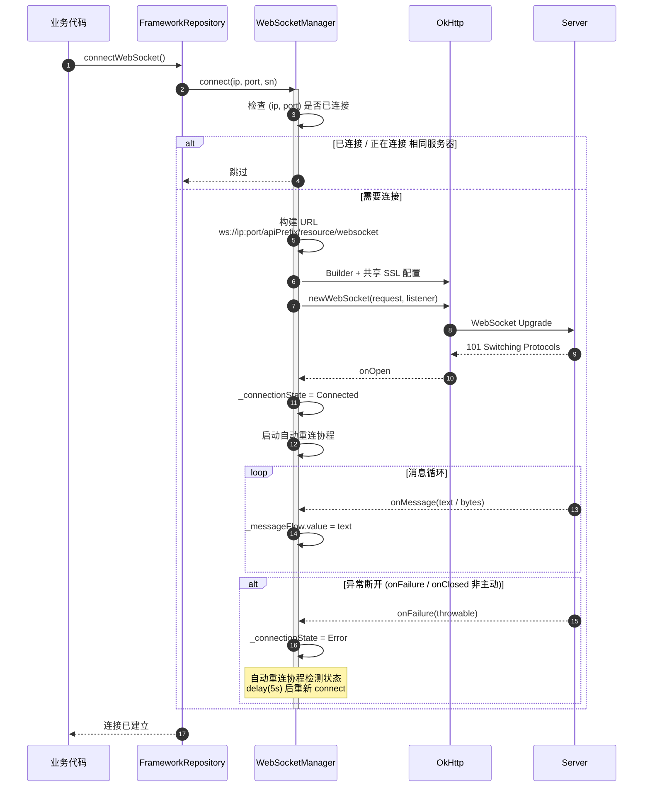

# 架构说明

## 整体分层

## 各模块职责

### 1. Framework（统一入口）
- 提供 `init(app, config)` 初始化方法
- 提供 `getContext / getConfig / getPreferences / getRepository` 单例访问
- 提供 `setOnTokenExpired(callback)` 注入 token 失效跳转回调

### 2. api（网络层）
- **`ApiService`** - 默认提供 4 个示例接口（POST @Body / GET 列表 / POST 复杂对象 / POST ApiResponse<Unit>）
- **`NetworkModule`** - Retrofit/OkHttp/SSL 工厂
- **`TokenInterceptor`** - 自动注入 `Authorization: Bearer {token}` 和 `clientid`
- **`AuthErrorInterceptor`** - 同时处理 HTTP 401 与业务 code 401，自动清理 token
- **`VersionInterceptor`** - 自动注入 `VersionCode` / `VersionName` Header
- **`HttpLoggingInterceptor`** - 详细打印请求/响应 Header 与 Body
- **`ApiResponse<T>`** - 统一响应包装（`code` / `msg` / `data`）
- **`FrameworkConfig`** - 运行时配置（debug、versionCode、SSL 策略等）

### 3. websocket（WebSocket 管理）
- **`WebSocketManager`** - 单例、自动重连、连接状态/消息以 `StateFlow` 暴露
- 复用 `NetworkModule.configureSslSocketFactory` 共享 SSL 策略
- 同一服务器多次 `connect` 不会重复连接

### 4. database（Room 模板）
- **`FrameworkDatabase`** - 默认包含 ProductHistory + Line + LinePosition（一对多示例）
- **`ProductHistoryDao` / `LineDao`** - CRUD + Flow 自动刷新
- 业务可继承 `FrameworkDatabase` 扩展自己的实体与 DAO

### 5. datastore（偏好设置）
- **`PreferencesManager`** - 通用 Key（IP / Port / Token / Language）
- **`DataStoreBackupHelper`** - DataStore + SharedPreferences 双写双读模式
- 业务可继承 `PreferencesManager` 添加自定义 Key

### 6. repository（仓库层）
- **`FrameworkRepository`** - ApiService 缓存（按 IP:Port 缓存）+ WebSocket 委托 + 3 个示例 API
- 业务可继承 `FrameworkRepository` 添加业务方法

### 7. ui/base（UI 基类）
- **`BaseActivity<VB>`** - ViewBinding + 全屏 + 点击外部隐藏键盘 + 禁用系统返回 + 语言切换
- **`BaseFragment<VB>`** - ViewBinding + 生命周期钩子
- **`BaseDialog(context)`** - 全屏 + 点击外部隐藏键盘
- **`BaseDialogFragment<VB>`** - 全屏 + 软键盘上移 + 点击外部隐藏键盘
- **`CommonAdapter<T, VB>`** - 单一 ViewBinding 适配器
- **`MultiViewTypeAdapter<T>`** - 多 ViewBinding 适配器

### 8. util（工具类）
- `TimberUtil` - Debug/Release 日志分流
- `DeviceUtils` - IP / SN / 大小写转换
- `ScreenUtil` - dp/px/sp 互转
- `LanguageUtils` - 中英文切换 + 淡入动画
- `FullScreenUtils` - 全屏 + Dialog 全屏扩展
- `ViewExtensions` - `setOnMultiClickListener`
- `EditTextExtensions` - `requestFocusSafely` / `keepFocus` / `setShowSoftInputOnFocus`
- `TimeUtils` - 时间格式化

### 9. constants（常量）
- `FrameworkConstants` - 超时 / Header 名称 / DataStore Key / 数据库名

## 核心流程

### 启动流程

### 网络请求流程

### WebSocket 连接流程

