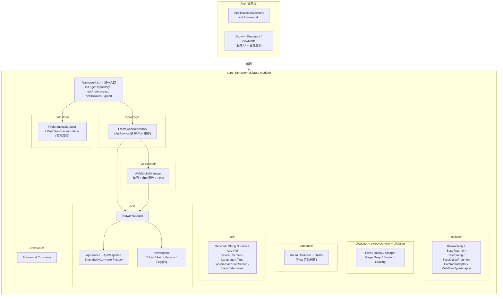
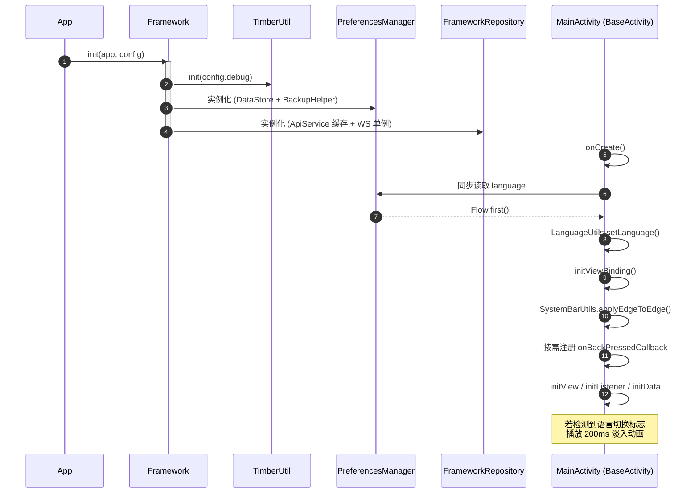
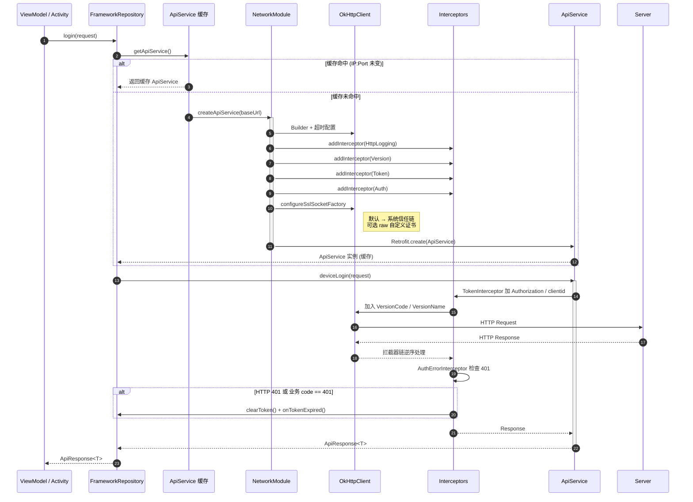
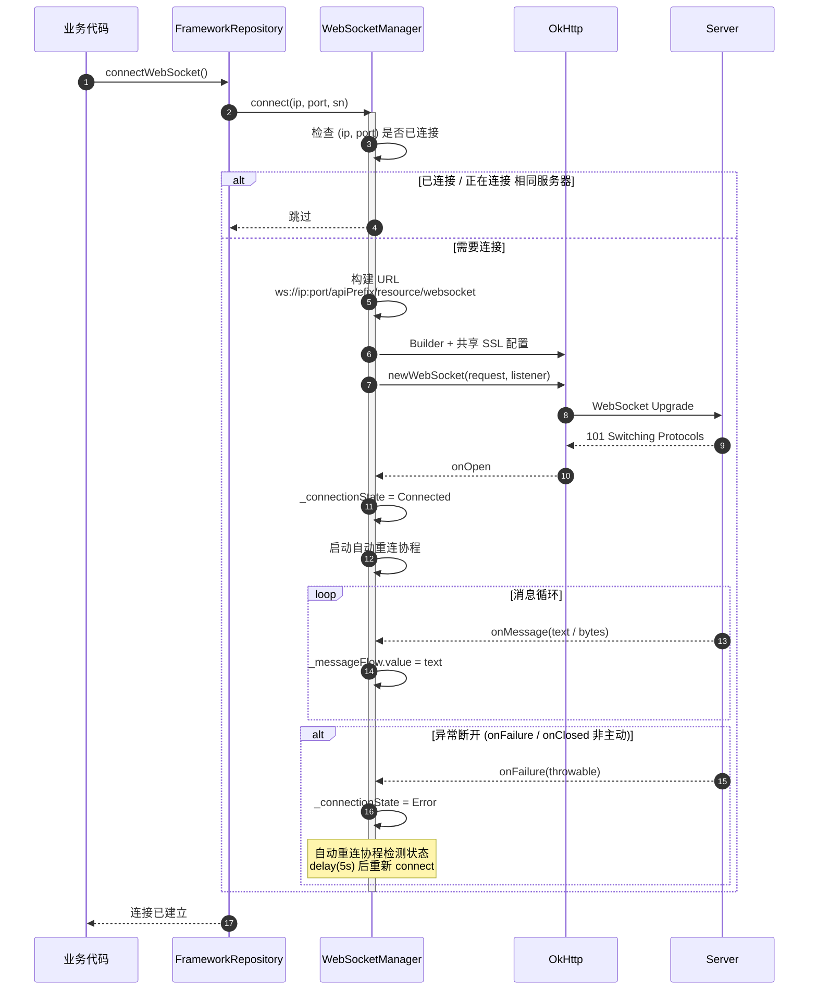

# 架构说明

本项目采用 `:app` + `:core_framework` 的单向模块依赖。框架层提供 Android 基础能力和
示例数据契约，业务 UI、业务状态、导航、依赖注入及具体服务端接口由 App 或后续
feature module 持有。模板支持 MVVM，但不会强制某一种业务架构实现。

## 整体分层

关键边界：

- `:app` 可以依赖 `:core_framework`，框架层不得反向引用 App 的 `BuildConfig`、资源或业务类型。
- `Framework.init()` 只负责日志、偏好管理和 Repository，不会自动打开数据库或连接 WebSocket。
- Room 数据库、Retrofit Service 和 WebSocket 都按使用时机创建，业务负责决定其生命周期。
- `ApiService`、生产模型和默认 Room 实体是示例契约；接入真实项目时可替换或移到业务层。

## 各模块职责

### 1. Framework（统一入口）
- 提供 `init(app, config)` 初始化方法
- 提供 `getContext / getConfig / getPreferences / getRepository` 单例访问
- 提供 `setOnTokenExpired(callback)` 注入 token 失效跳转回调

### 2. api（网络层）
- **`ApiService`** - 默认提供 4 个示例接口（POST @Body / GET 列表 / POST 复杂对象 / POST ApiResponse<Unit>）
- **`NetworkModule`** - Retrofit/OkHttp/SSL 工厂
- **`TokenInterceptor`** - 自动注入 `Authorization: Bearer {token}` 和 `clientid`
- **`AuthErrorInterceptor`** - 同时处理 HTTP 401 与业务 code 401，自动清理 token
- **`VersionInterceptor`** - 自动注入 `VersionCode` / `VersionName` Header
- **`HttpLoggingInterceptor`** - 详细打印请求/响应 Header 与 Body
- **`ApiResponse<T>`** - 统一响应包装（`code` / `msg` / `data`）
- **`EmptyBodyConverterFactory`** - 可选的 Retrofit 空 Body 转换器，默认 NetworkModule 未注册
- **`FrameworkConfig`** - 运行时配置（debug、versionCode、SSL 策略等）

### 3. websocket（WebSocket 管理）
- **`WebSocketManager`** - 单例、自动重连、连接状态/消息以 `StateFlow` 暴露
- 复用 `NetworkModule.configureSslSocketFactory` 共享 SSL 策略
- 同一服务器多次 `connect` 不会重复连接

### 4. database（Room 模板）
- **`FrameworkDatabase`** - 默认包含 ProductHistory + Line + LinePosition（一对多示例）
- **`ProductHistoryDao` / `LineDao`** - CRUD + Flow 自动刷新
- 默认启用 `fallbackToDestructiveMigration`，示例阶段升级会清表，生产项目必须定义迁移策略
- 业务数据库建议在 App 独立定义；确需继承时必须显式声明全部实体并创建 AppDatabase 实例

### 5. datastore（偏好设置）
- **`PreferencesManager`** - 通用 Key（IP / Port / Token / Language）
- **`DataStoreBackupHelper`** - DataStore + SharedPreferences 双写双读模式
- 框架 DataStore 名固定为 `framework_preferences`，自定义 Key 建议放入 App 自己的 DataStore
- `FrameworkConfig.dataStoreName` 当前只参与默认 Room 数据库名派生，不会更改 DataStore 名

### 6. repository（仓库层）
- **`FrameworkRepository`** - ApiService 缓存（按 IP:Port 缓存）+ WebSocket 委托 + 3 个示例 API
- 业务可继承 `FrameworkRepository` 添加业务方法

### 7. ui/base（UI 基类）
- **`BaseActivity<VB>`** - ViewBinding + edge-to-edge 系统栏适配 + 点击外部隐藏键盘 + 可选返回键拦截 + 语言切换
- **`BaseFragment<VB>`** - ViewBinding + 生命周期钩子
- **`BaseDialog(context)`** - 可选沉浸式全屏 + 点击外部隐藏键盘
- **`BaseDialogFragment<VB>`** - 全窗口展示 + 可选沉浸式全屏 + 软键盘上移 + 点击外部隐藏键盘
- **`CommonAdapter<T, VB>`** - 单一 ViewBinding 适配器
- **`MultiViewTypeAdapter<T>`** - 多 ViewBinding 适配器

### 8. ui/widget、ui/recyclerview、ui/dialog（可复用组件）

- **`FlowLayout`** - 支持间距、最大行数和 RTL 的流式布局
- **`RatingStarView`** - 支持半星、只读、RTL 和状态恢复的评分控件
- **`NumberStepperView`** - 支持上下限、步长和回调的整数步进器
- **`GridPagerSnapHelper`** - RecyclerView 固定行列分页吸附
- **`DividerItemDecoration`** - 横向/纵向列表分割线
- **`LoadingDialog`** - 复用 BaseDialog 约定的加载弹窗

组件属性、代码示例和资源约定见 [可复用组件说明](./REUSABLE_COMPONENTS.md)。

### 9. util（工具类）

- `TimberUtil` - Debug/Release 日志分流
- `DeviceUtils` - IP / SN / 大小写转换
- `AppInfoUtils` - 版本信息和系统拨号器
- `DecimalUtils` / `StringNumberExtensions` - 十进制运算与安全数值转换
- `ScreenUtil` - dp/px/sp 互转
- `LanguageUtils` - 中英文切换 + 淡入动画
- `SystemBarUtils` - 通用 edge-to-edge 与安全区域适配
- `FullScreenUtils` - kiosk 场景的 Activity / Dialog 沉浸式全屏
- `ViewExtensions` - `setOnMultiClickListener`
- `EditTextExtensions` - `requestFocusSafely` / `keepFocus` / `setShowSoftInputOnFocus`
- `TimeUtils` - 时间格式化

### 10. constants（常量）

- `FrameworkConstants` - 超时 / Header 名称 / DataStore Key / 数据库名

## 核心流程

### 启动流程

### 网络请求流程

### WebSocket 连接流程

